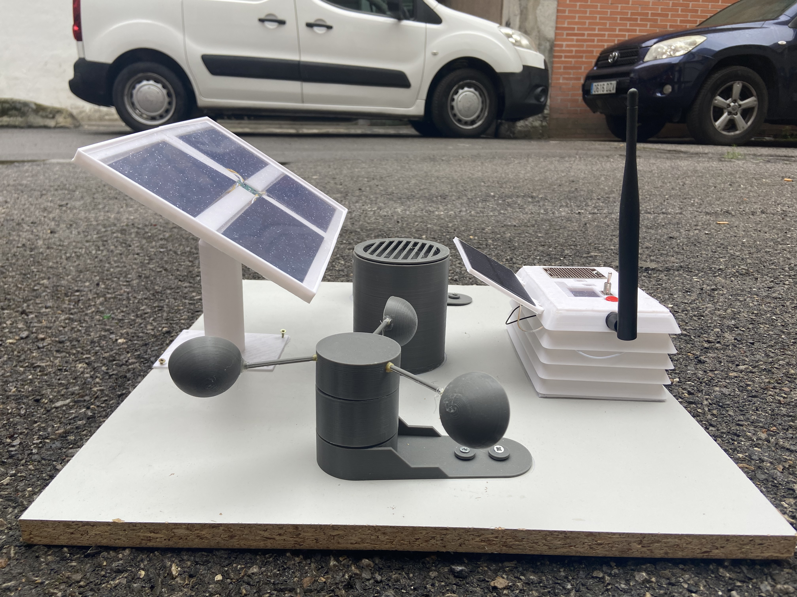

## Table of Contents

- [Description](#description)
- [Programming](#programming)
- [About me](#about)
- [Support](#support)
- [License](#license)

---

   
## Description

 

This report will include the entire process carried out for the design and construction of a prototype of a meteorological station where data on different environmental variables will be collected for subsequent analysis.

The creation of the prototype, the different electronic components needed, the communications infrastructure, the necessary programming code and the creation of a user interface will be discussed in order to view the data collected on a web page.

The project has been carried out in a self-taught way thanks to the material provided by the Library of the Carlos III University of Madrid and the Internet and consultations made to professors, under the supervision of my TFM professor.

 

 

 * [See The complete master thesis:](-------) - Bachelor Thesis uploaded in format PDF.
 
 * [Electrical design:](https://github.com/albertito1998/wheather-station/tree/master/Eagle) - Electrical connections.

## Programming
 * [C++](https://isocpp.org/) - Programming language.
 * [JavaScript](https://www.javascript.com/) - Programming language.
 * [Bootstrap - HTML5](https://getbootstrap.com/) - A modern responsive front-end framework
 * [Firebase](https://firebase.google.com/?hl=es-419) - Google Cloud Platform

## Microprocessors and communication
 * [Esp32](https://www.espressif.com/en/products/socs/esp32) - Espressif
* [Lora](https://heltec.org/) - Heltec

## Sensors
- BMP180
- CCS811
- INA226
- DHT22
- RAIN GAUGE AND ANEMOMETER

**Real Data Display**
Thanks to the Firebase ICloud platform, data can be displayed in dynamic charts using its Realtime Database utility.

## Website
[Go to the website!! ](https://wheather-station-18cb0.web.app/)

## About 

Industrial engineering student at Carlos III University. Passion for technology, especially electronics, programming and the world of IoT!. See my CV in the following link: [CV ](https://github.com/albertito1998/SeedbedwebsiteApp/blob/master/photos/Alberto%20G%C3%B3mez%20Zueco.pdf)

## Support

Reach out to me at one of the following places!

- Linkedin at <a href="https://www.linkedin.com/in/alberto-gomez-zueco-995538179/" target="_blank">`Linkedin`</a>
- Instagram at <a href="https://www.instagram.com/alber_gz/" target="_blank">`Instagram`</a>

---

## License

- **[MIT license](http://opensource.org/licenses/mit-license.php)**
- Copyright 2022 © <a href="/LICENSE" target="_blank">MIT LICENSE ALBERTO GÓMEZ</a>.
